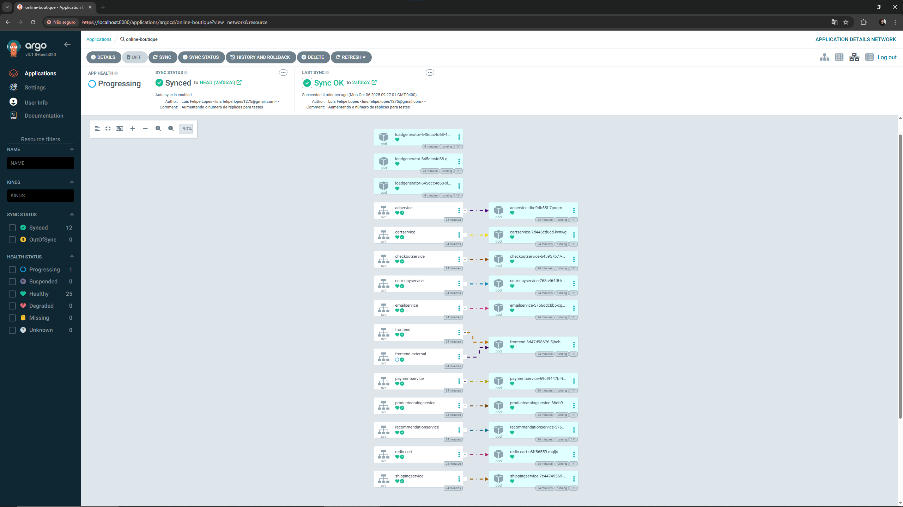
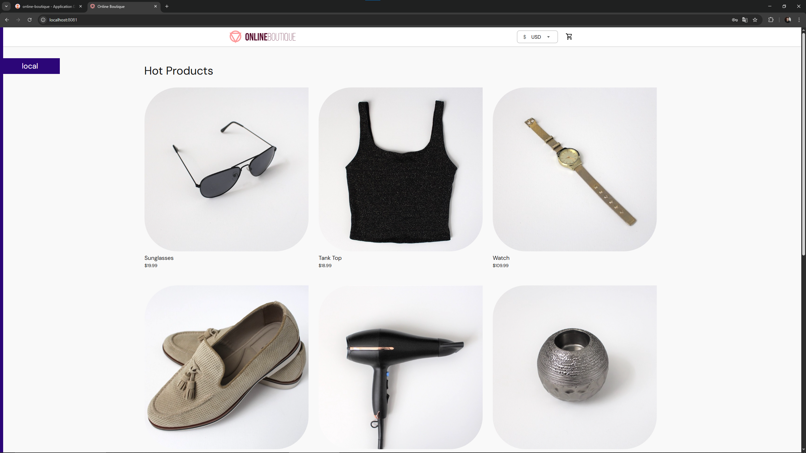

# 🛒 Online Boutique - Microservices Demo com Kubernetes e Argo CD

[]()
[]()
[]()

Este repositório contém a versão configurada do **projeto Online Boutique** da Google Cloud Platform, adaptado para rodar com **Kubernetes** e gerenciado pelo **Argo CD**.  
Ele simula uma loja online com múltiplos microserviços (front-end, back-end, carrinho, checkout, pagamento, recomendação, etc).

---

## 🚀 Estrutura do Projeto

O projeto é composto pelos seguintes microserviços:

| Serviço                  | Tipo         | Porta |
|--------------------------|-------------|-------|
| `frontend`               | Deployment  | 8080  |
| `cartservice`            | Deployment  | 7070  |
| `checkoutservice`        | Deployment  | 5050  |
| `currencyservice`        | Deployment  | 7000  |
| `emailservice`           | Deployment  | 5000  |
| `paymentservice`         | Deployment  | 50051 |
| `productcatalogservice`  | Deployment  | 3550  |
| `recommendationservice`  | Deployment  | 8080  |
| `shippingservice`        | Deployment  | 50051 |
| `adservice`              | Deployment  | 9555  |
| `loadgenerator`          | Deployment  | 80    |
| `redis-cart`             | Deployment  | 6379  |

Todos os serviços estão configurados com **ServiceAccounts**, probes de **readiness e liveness**, e limites de recursos (CPU/memória).

---

## 📂 Estrutura de Diretórios
```bash
gitops-microservices/
├── img/
├── k8s/
│   └── online-boutique.yaml
├── LICENSE
└── README.md
```

> Observação: Todos os manifests foram unificados em um único arquivo `online-boutique.yaml`.

---

## ⚙️ Pré-requisitos

- [Kubernetes](https://kubernetes.io/docs/tasks/tools/) (minikube, k3s ou GKE)
- [kubectl](https://kubernetes.io/docs/tasks/tools/install-kubectl/)
- [Argo CD](https://argo-cd.readthedocs.io/en/stable/getting_started/)
- Conta no GitHub (para clonar o repositório)

---

## 💾 Clonando o Repositório

```bash
git clone https://github.com/Luisdevux/gitops-microservices.git
cd gitops-microservices
```

---

## 📌 Configurando o Argo CD

### 1. Acesse seu cluster Kubernetes e instale o Argo CD se ainda não estiver instalado:

```bash
kubectl create namespace argocd
kubectl apply -n argocd -f https://raw.githubusercontent.com/argoproj/argo-cd/stable/manifests/install.yaml
```

### 2. Acesse o Argo CD UI:

```bash
kubectl port-forward svc/argocd-server -n argocd 8080:443
```

#### Abra https://localhost:8080 no navegador.

### 3. Em outra aba do terminal, execute esse comando para obter sua senha:

```bash
kubectl -n argocd get secret argocd-initial-admin-secret -o jsonpath="{.data.password}" | base64 -d
```

---

## 📂 Criando a Aplicação no Argo CD

### No Argo CD UI:
- Application Name: online-boutique
- Project: default
- Repository URL: https://github.com/Luisdevux/gitops-microservices
- Revision: HEAD
- Path: k8s
- Destination Cluster: https://kubernetes.default.svc
- Destination Namespace: default
- Sync Policy: Manual ou Automatic
- Clique em Create e sincronize a aplicação.

---

## ✅ Sincronização e Status

### Verifique o status dos pods:

```bash
kubectl get pods -A
```

### Exemplo de saída:

```bash
NAMESPACE     NAME                                     READY   STATUS
online-boutique  frontend-xxxxx-xxxxx                   1/1     Running
online-boutique  cartservice-xxxxx-xxxxx                1/1     Running
...
```

### Todos os pods devem estar Running e com 1/1 containers prontos.

---

## 🌐 Acessando o Front-end da Online Boutique no Localhost

#### Se você está rodando os microserviços no cluster do Kubernetes via Argo CD, é possível acessar o front-end localmente usando `kubectl port-forward`.  

### 1️⃣ Listando os pods do front-end

Primeiro, encontre o pod do front-end:

```bash
kubectl get pods -n default | grep frontend
```

Exemplo de saída:
```bash
frontend-645dcc4d68-abcde  1/1  Running  0  5m
```

### 2️⃣ Criando o port-forward
Execute o seguinte comando substituindo `frontend-645dcc4d68-abcde` pelo nome do seu pod:

```bash
kubectl port-forward pod/frontend-645dcc4d68-abcde 8081:8080 -n default
```
Isso irá redirecionar a porta 8080 do pod para a porta 8081 da sua máquina local.

## 💬 Alternativamente, você pode fazer o redirecionamento via Service:
```bash
kubectl port-forward service/frontend 8081:80 -n default
```
Isso redireciona a porta 80 do Service (mapeada para 8080 do pod) para a porta 8081 do seu host.

### 3️⃣ Acessando pelo navegador
Abra o navegador e acesse:
http://localhost:8081

Agora você verá o front-end da Online Boutique e poderá interagir com todos os microserviços como se estivesse rodando em produção.

---

## 🔧 Ajustando Réplicas (Opcional)

### Para o loadgenerator aumentar a carga simulada, altere o número de réplicas no manifest:

```yaml
spec:
  replicas: 3
```

### Depois, dê push e sincronize no Argo CD. Os novos pods serão criados automaticamente.

---

## 📌 Dicas e Observações:
- Todos os serviços têm readiness/liveness probes para garantir saúde do cluster.
- O Argo CD mostra OutOfSync, Syncing e Healthy para monitoramento.
- Aumentar réplicas do loadgenerator gera mais requisições para testar escalabilidade.
- Certifique-se de usar o namespace correto para evitar erros de sincronização.

---

## 🖥️ Exemplo Da Estrutura no Argo CD



---

## 🧪 Exemplo de Funcionamento:



---

## 📚 Referências
- [GoogleCloudPlatform/microservices-demo](https://github.com/GoogleCloudPlatform/microservices-demo)
- [Kubernetes Documentation](https://kubernetes.io/docs/home/)
- [Argo CD Documentation](https://argo-cd.readthedocs.io/en/stable/)

> ### Este projeto está licenciado sob a [Licença MIT](./LICENSE).